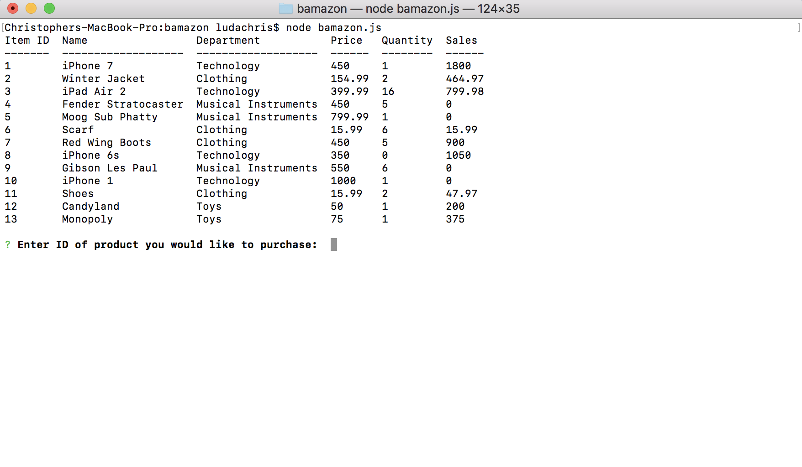

# Bamazon MySQL Database App

## What it is

Bamazon is a node.js app utilizng a MySQL database to mimic an online shopping application. 
It allows users to buy a certain amount of products if there is enough in stock, as well as view a 
Manager portal that allows them to see all available products, see products with a low 
inventory (< 5), add more quantity of an object, and also add a new item. The Supervisor
portal allows the user to see the different departments total revenue, as well as the ability 
to add a new department. 

## Functionality

