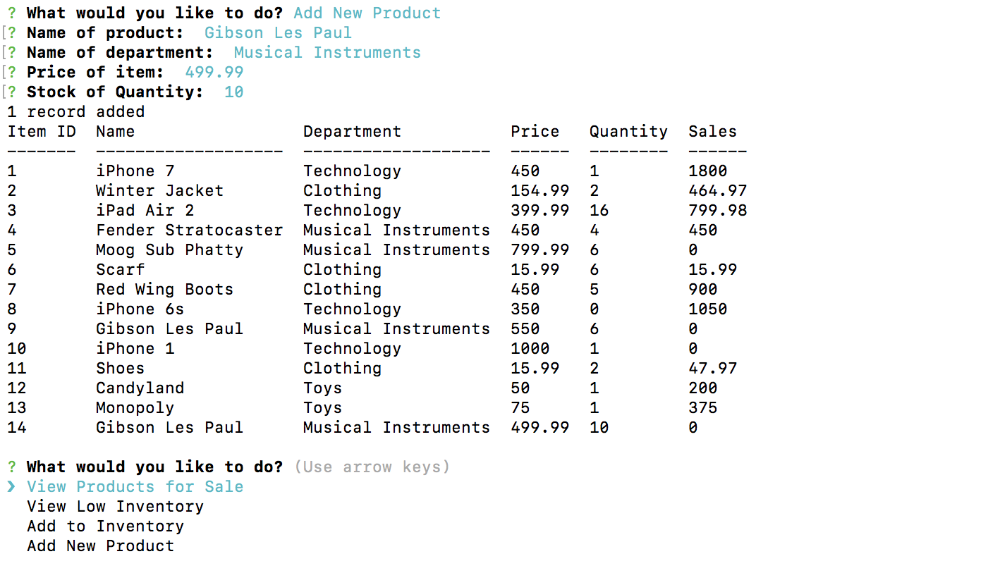

# Bamazon MySQL Database App

## What it is

Bamazon is a node.js app utilizng a MySQL database to mimic an online shopping application. 
It allows users to buy a certain amount of products if there is enough in stock, as well as view a 
Manager portal that allows them to see all available products, see products with a low 
inventory (< 5), add more quantity of an object, and also add a new item. The Supervisor
portal allows the user to see the different departments total revenue, as well as the ability 
to add a new department. 

## Functionality

### bamazon.js

The bamazon.js app begins by showing the user the available products the user can buy. This was 
done by using a "SELECT * FROM" call to the products database in MySQL. 

A successful transaction is performed if the user enters in a quantity that is equal to or less
than the current amount of each object. This was done by first selecting the correct object 
in the database using "WHERE item_id = ?", inputting the user choice, and then seeing if that amount was equal
to or lower than the quantity in the database. If it was, the quantity was updataed as well as the product sales
for that item. 

If the user enters in a quantity that is greater than the amount available, the app prints a message and 
nothing is done to the database.

### bamazonManager.js

The bamazonManager.js app first starts out by displaying the menu of options the user is able to choose.

If the user chooses the view products option, the table of available products is printed to the 
console.

The view low inventory option allows the user to see which products have a current quantity
that is less than 5. This table was created with another "SELECT * FROM" call, utilizing the WHERE 
condition to select which products have a quantity less than 5. 

If the user chooses the add more to inventory option, they will be prompted to choose an ID of a particular
object and an amount to add to its quantity. This was performed with another set of SELECT and UPDATE calls, similar to 
the purchasing functionality of the bamazon.js app.

The add new product option will give the user the ability to add a whole new product to the database. After the user
enters in all the needed information, it is placed in the table with the INSERT INTO condition

### bamazonSupervisor.js

The final bamazonSupervisor.js app initially displays a menu of two options, view a table displaying
the total revenue produced by department and the ability to add a new department to the system.

The table presents each unique department in the products table, as well as their ID number
and over head costs. The total cost produced by each department was calculated by using the 
SUM condition from MySQL, and then the GROUP BY call in order to sum up the total sales of each 
item by department. A RIGHT JOIN call was used in order to successfully merge the products and 
departments table together in order for the correct total sales to match each department. 

In order to calculate the total revenue, I created an alias of the calculation sum(product_sales) - over_head_costs
, and using the AS keyword I titled the alias total_profit.

Creating a new department was done in a very similar way compared to the bamazon.js and bamazonManager.js apps. 

### NPM Packages

The packages I used within this project included:

	-mysql
	-inquirer
	-console table (to format the tables nicely)

